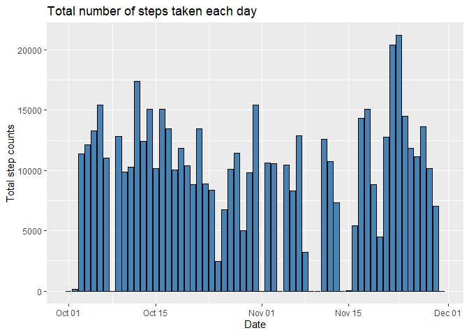
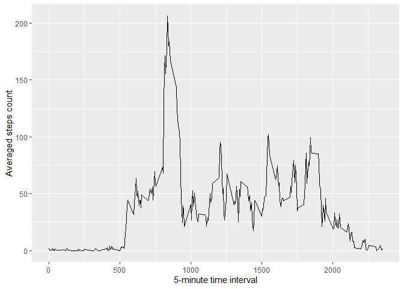
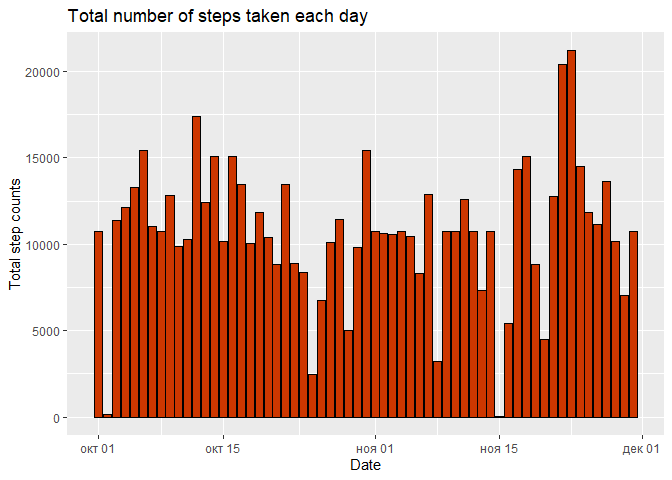
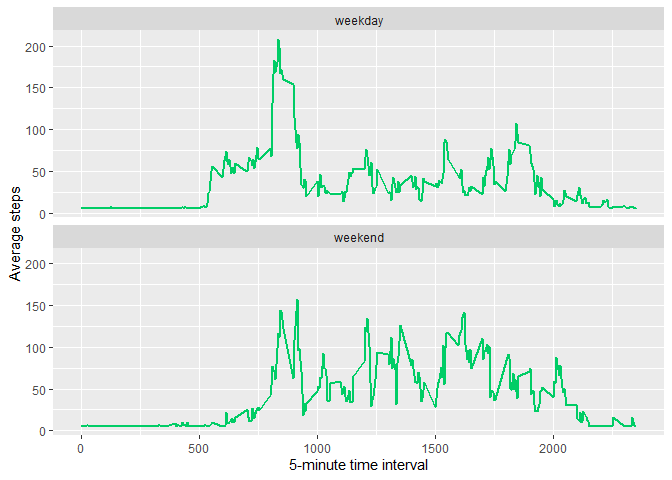

## Loading and preprocessing the data

```r
library(dplyr)
library(ggplot2)

# set locale from Bad-Russian to English
Sys.setlocale("LC_TIME", "English")
```

```
## [1] "English_United States.1252"
```

```r
zipFile <- "activity.zip"
filename <- "activity.csv"

# unzip if file doesn't already exist
if (!file.exists(filename)) {
        unzip(zipFile)
}

# read data
df <- read.csv(filename)

# convert Date type
df <- mutate(df, date = as.Date(date, "%Y-%m-%d"))
```


## What is mean total number of steps taken per day?
**1. Calculate the total number of steps taken per day**

```r
# group by days
groupedDf <- group_by(df, date)

# sum steps of each day
stepsPerDay <- summarise(groupedDf, steps = sum(steps, na.rm = TRUE))
```
**2. Make a histogram of the total number of steps taken each day**

```r
ggplot(stepsPerDay, aes(x=date, y=steps)) + 
        geom_bar(stat = "identity", color = "black", fill = "steelblue") + 
        labs(title = "Total number of steps taken each day", x = "Date", y = "Total step counts")
```



**3. Calculate and report the mean and median of the total number of steps taken per day**

```r
stepsMean <- summarise(stepsPerDay, stepsMean = round(mean(steps, na.rm = TRUE), 0))
stepsMedian <- summarise(stepsPerDay, stepsMedian = median(steps, na.rm = TRUE))
```
The Mean value of the number of steps taken per day is - 9354 steps.  
The Median value of the number of steps taken per day is - 10395 steps.


## What is the average daily activity pattern?
**1. Make a time series plot (i.e. type = "l") of the 5-minute interval (x-axis) and the average number of steps taken, averaged across all days (y-axis)**


```r
# group data by 5 minute interval
groupByInterval <- group_by(df, interval)

# remove NA rows
groupByInterval <- filter(groupByInterval, !is.na(steps))

# summarise average value of each time interval
groupByInterval <- groupByInterval %>% summarise(averageSteps = mean(steps))
```

```r
# construct graph
qplot(x = interval, 
      y = averageSteps, 
      data = groupByInterval,
      geom = "line",
      ylab = "Averaged steps count", 
      xlab = "5-minute time interval")
```



**2. Which 5-minute interval, on average across all the days in the dataset, contains the maximum number of steps?**

```r
# max average 5-minute interval steps count
maxSteps <- groupByInterval[which.max(groupByInterval$averageSteps),]
maxInterval <- sub("(?<=.{2})", ":", sprintf("%04d", maxSteps$interval), perl = TRUE)
```
The "08:35" is 5-minute interval, on average across all the days in the dataset, which contains max number of steps - 206.1698113.


## Imputing missing values

**1. Calculate and report the total number of missing values in the dataset (i.e. the total number of rows with NAs)**

```r
# calculate row numbers of step column with NA value
missingValues <- sum(is.na(df$steps))
```
Total number of missing values is 2304.

**2. Devise a strategy for filling in all of the missing values in the dataset. The strategy does not need to be sophisticated. For example, you could use the mean/median for that day, or the mean for that 5-minute interval, etc.**
To filling all of the missing values in the dataset was choosed  strategy to use mean for 5-minute interval. 


**3. Create a new dataset that is equal to the original dataset but with the missing data filled in.**

```r
# 5-minute interval means for each day
mInterval <- df %>% group_by(date) %>% summarise(steps = mean(steps, na.rm = TRUE))

# get total dates 5-minute interval mean value
allDayIntervalMean <- mean(mInterval$steps, na.rm = TRUE)

# replace NaN's with allDaysIntervalMeanValue
mInterval <- mutate(mInterval, steps = ifelse(is.na(steps), allDayIntervalMean, steps))

# get NA indexes
naIndexes <- which(is.na(df$steps))

# replace NAs with mean values
filledNAdata <- df
for(i in naIndexes){
        filledNAdata$steps[i] <- mInterval$steps[mInterval$date == filledNAdata$date[i]]
}

# free up memory
rm(mInterval, naIndexes, allDayIntervalMean)
```

**4. Make a histogram of the total number of steps taken each day and Calculate and report the mean and median total number of steps taken per day. Do these values differ from the estimates from the first part of the assignment? What is the impact of imputing missing data on the estimates of the total daily number of steps?**


```r
filledDf <- filledNAdata %>% group_by(date) %>% summarise(steps = sum(steps))
```


```r
ggplot(filledDf, aes(x=date, y=steps)) + 
        geom_bar(stat = "identity", color = "black", fill = "orangered3") + 
        labs(title = "Total number of steps taken each day", x = "Date", y = "Total step counts")
```




```r
newStepsMean <- as.integer(mean(filledDf$steps))
newStepsMedian <- as.integer(median(filledDf$steps))
```
* **With NAs:**  
1. The **Mean** value of the number of steps taken per day is - **9354 steps**.  
2. The **Median** value of the number of steps taken per day is - **10395 steps**.

* **With replacing NAs by mean of all days 5-minute intervals:**  
1. The **Mean** value of the number of steps taken per day is - **10766 steps**.  
2. The **Median** value of the number of steps taken per day is - **10766 steps**.

## Are there differences in activity patterns between weekdays and weekends?

**1.Create a new factor variable in the dataset with two levels "weekday" and "weekend" indicating whether a given date is a weekday or weekend day.** 


```r
# add column wday with two variation: weekend or weekday
filledNAdata <- mutate(filledNAdata,
                       wday = ifelse(substr(weekdays(date), 1, 1) ==  "S", "weekend", "weekday"))
filledNAdata$wday <- as.factor(filledNAdata$wday)
head(filledNAdata)
```

```
##     steps       date interval    wday
## 1 37.3826 2012-10-01        0 weekday
## 2 37.3826 2012-10-01        5 weekday
## 3 37.3826 2012-10-01       10 weekday
## 4 37.3826 2012-10-01       15 weekday
## 5 37.3826 2012-10-01       20 weekday
## 6 37.3826 2012-10-01       25 weekday
```

**2.Make a panel plot containing a time series plot (i.e. type = "l") of the 5-minute interval (x-axis) and the average number of steps taken, averaged across all weekday days or weekend days (y-axis). See the README file in the GitHub repository to see an example of what this plot should look like using simulated data.**


```r
filledNAdata <- filledNAdata %>% group_by(wday, interval) %>% summarise(avrg = mean(steps))
```

```r
ggplot(filledNAdata, aes(x = interval, y = avrg)) +
        geom_line(col = "springgreen3", size = 1) +
        facet_wrap(~ wday, nrow = 2, ncol = 1) + 
        labs(x = "5-minute time interval", y = "Average steps")
```



